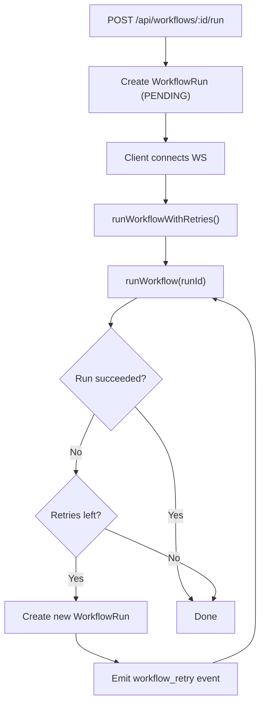
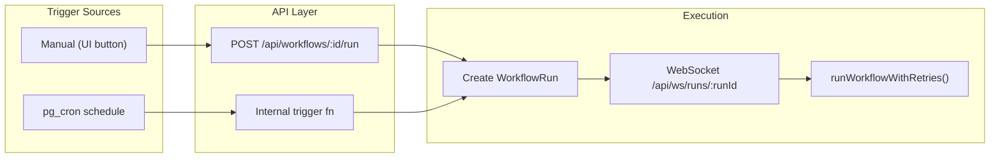

# Engine Refinement: Retry, Condition Safety, Triggers

## Confirming: workflow runs are ephemeral

Yes. Each `runWorkflow` call creates fresh `StepRun` rows, spins up disposable Docker containers (force-removed after execution), and uses an in-memory `runContext`. No state carries between runs.

---

## 1. Configurable Retry Logic + Global Timeout + Workflow Settings

### 1A. Schema: `WorkflowSettings` on `Workflow` model

Add a `settings Json?` column to `Workflow` in [prisma/tenant/schema.prisma](prisma/tenant/schema.prisma):

```prisma
model Workflow {
  ...
  settings Json?
  ...
}
```

Type definition in a new `lib/dag/workflowSettings.ts`:

```typescript
export interface WorkflowSettings {
  defaultNodeRetries: number;      // 0-10, applied to nodes without explicit retries
  defaultRetryDelayMs: number;     // base delay for exponential backoff (delay = base * 2^attempt)
  maxNodeFailures: number;         // how many node failures before workflow stops
  workflowRetries: number;         // how many times to restart the entire workflow (new WorkflowRun each)
  globalTimeoutMs: number;         // max wall-clock time for a single workflow run
}
```

Defaults: `{ defaultNodeRetries: 0, defaultRetryDelayMs: 1000, maxNodeFailures: 1, workflowRetries: 0, globalTimeoutMs: 300000 }` (5 min).

### 1B. Settings UI: TopHeader settings button

In [components/layout/TopHeader.tsx](components/layout/TopHeader.tsx), add a gear/settings button next to the existing controls. Clicking it opens a **dialog** (portal, same pattern as the Debug JSON dialog). Contents:

- **Default retries per node** — number input (0-10)
- **Retry base delay** — number input in ms
- **Max node failures** — number input (1-N): how many nodes can fail before the run stops
- **Workflow retries** — number input (0-5): how many times to re-run the entire workflow
- **Global timeout** — number input in seconds (converted to ms)

Settings are stored in a new Jotai atom `workflowSettingsAtom` in `store/workflowStore.ts` and persisted via the existing workflow save flow (PATCH to API).

### 1C. API changes

- **PATCH** [app/api/workflows/route.ts](app/api/workflows/route.ts) (or the workflow-specific route): accept `settings` in the body, validate with Zod, write to `Workflow.settings`.
- **GET** workflow response: include `settings`.
- **POST /api/workflows/[id]/run**: load `Workflow.settings` and pass it alongside the definition.

### 1D. DAG export: apply defaults

In [lib/canvas/dagExporter.ts](lib/canvas/dagExporter.ts), extend `exportCanvasToDag` to accept `WorkflowSettings`. For each node, if `retries` is undefined, apply `settings.defaultNodeRetries`. Same for `retryDelayMs`.

### 1E. Engine changes

**Global timeout** in [lib/orchestrator/executionEngine.ts](lib/orchestrator/executionEngine.ts):

- Wrap the execution loop with `AbortController` + `setTimeout(globalTimeoutMs)`.
- On timeout: kill running containers (via Dockerode `container.kill()`), mark run as `TIMEOUT`, emit `RunComplete` with `TIMEOUT` status.
- **Log the timeout** to each affected `StepRun.logs` (append `[TIMEOUT] Step killed — workflow exceeded global timeout of Xs`) and to `WorkflowRun` so the user can see exactly which steps were interrupted and why in the execution sidebar / run history.

**Container-level timeout** in [lib/orchestrator/dockerRunner.ts](lib/orchestrator/dockerRunner.ts):

- After `container.start()`, race `container.wait()` against a timeout (e.g., derived from global timeout or a per-step cap).
- If timeout fires: `container.kill()` then `container.remove()`, return `exitCode: 124` (standard timeout exit code) with logs indicating timeout.

**Partial failure tolerance** (`maxNodeFailures`):

- Change `Promise.all` to `Promise.allSettled` for each topological level.
- Track `failedNodeCount`. If a node fails and `failedNodeCount < maxNodeFailures`, continue; otherwise, throw and end the run.
- This allows workflows to tolerate some node failures before giving up.

**Workflow-level retries**:

- New wrapper function `runWorkflowWithRetries(workflowVersionId, definition, settings, tenantDb, triggeredById)` in `executionEngine.ts`.
- For each retry: create a new `WorkflowRun` row (new run ID), call `runWorkflow`.
- If the run fails and retries remain, emit a `workflow_retry` event to the EventBus with the old and new run IDs so the WS client can follow.
- The WS handler in [app/api/ws/runs/[runId]/route.ts](app/api/ws/runs/[runId]/route.ts) subscribes to retry events and forwards the new run ID to the client. The client can then subscribe to events for the new run.



---

## 2. Condition Node Safety

### Current behavior (gaps)

- Condition scripts run as `node -e <script>` in `node:20-alpine` with full network access.
- Output parsing in `parseNodeOutputs` takes the **last line** of stdout and extracts fields listed in `node.outputs`, but there is no validation that `result` is actually boolean.
- If `node.outputs` does not include `"result"`, the engine gets `{}` and defaults to the `false` branch silently.
- No network or filesystem isolation beyond Docker defaults.

### My recommendation (defense-in-depth, three layers):

**Layer 1 — Wrapper script** (in `dockerRunner.ts`): Wrap the user's condition script in a harness:

```javascript
// Wrapper injected by engine
const __origLog = console.log;
let __lastOutput = null;
console.log = (...args) => {
  __lastOutput = args[0];
  __origLog.apply(console, args);
};
try {
  // === user script ===
  <user_condition_script>
  // === end user script ===
} catch (e) {
  process.stderr.write('Condition script error: ' + e.message + '\n');
  process.exit(2);
}
// Validate output
try {
  const parsed = JSON.parse(__lastOutput);
  if (typeof parsed !== 'object' || parsed === null || typeof parsed.result !== 'boolean') {
    process.stderr.write('Condition must output { "result": true } or { "result": false }\n');
    process.exit(3);
  }
} catch {
  process.stderr.write('Condition output is not valid JSON\n');
  process.exit(3);
}
```

This ensures:
- The script **must** print valid JSON with a boolean `result` key, or the step fails with a clear error.
- Uncaught exceptions in user code are caught and fail the step cleanly (exit 2).
- **Errors are visible to the user**: The wrapper writes to `stderr` which Docker captures in container logs. These logs are stored in `StepRun.logs` and broadcast via WebSocket `StepEvent.logs`, so the user sees messages like "Condition must output { result: true } or { result: false }" directly in the Execution Sidebar and run history — not silently swallowed.

**Layer 2 — Docker network isolation**: Create condition containers with `NetworkDisabled: true` in the `HostConfig`. Condition logic should be pure computation on inputs, not making HTTP calls. If someone needs network in a condition, they should use a SCRIPT_EXECUTION node upstream and pipe the result.

**Layer 3 — Execution timeout**: Condition containers get a short timeout (30s by default, configurable). The container-level timeout from 1E handles this.

### Exporter fix

In [lib/canvas/dagExporter.ts](lib/canvas/dagExporter.ts), ensure CONDITION nodes **always** have `outputs: ['result']` regardless of what `data.outputs` says. This prevents the silent "no outputs" bug.

### Engine post-check

In `executionEngine.ts`, after `parseNodeOutputs` for CONDITION nodes, explicitly validate that `outputs.result` is `true` or `false`. If it's anything else (number, string other than "true"/"false", undefined), mark the step as FAILED with a descriptive error.

---

## 3. Workflow Triggering

### 3A. Cron via pg_cron

**Architecture consideration**: Since this is a multi-tenant app with per-tenant DBs, pg_cron needs to be installed on each tenant PostgreSQL instance. Alternatively, a single "scheduler" database (management DB) manages all cron jobs and triggers runs via HTTP.

Recommended approach — **pg_cron on management DB + internal API call**:

- Install `pg_cron` extension on the management PostgreSQL instance.
- New table in management schema:

```prisma
model WorkflowSchedule {
  id           String  @id @default(uuid())
  tenantId     String
  workflowId   String
  cronExpr     String  // e.g. "0 */6 * * *"
  enabled      Boolean @default(true)
  pgCronJobId  Int?    // pg_cron job id for management
  createdAt    DateTime @default(now())
  updatedAt    DateTime @updatedAt

  @@unique([tenantId, workflowId])
}
```

- A `pg_cron` job runs a SQL function that inserts into a `PendingScheduledRun` table (or uses `pg_net` to POST to an internal endpoint).
- A lightweight polling loop in the Next.js app (or a `LISTEN/NOTIFY` subscriber) picks up pending scheduled runs and calls the existing `POST /api/workflows/:id/run` logic internally.
- **UI**: Add a "Schedule" tab or section in the workflow settings dialog (from 1B) with a cron expression input + enable/disable toggle.
- **API**: `POST/PATCH /api/workflows/:id/schedule` to create/update the cron schedule.



---

## Files to create or modify

- **New**: `lib/dag/workflowSettings.ts` (types + defaults + Zod schema)
- **New**: `components/ui/WorkflowSettingsDialog.tsx` (settings UI)
- **New**: `app/api/workflows/[id]/schedule/route.ts` (cron schedule CRUD)
- **Modify**: [prisma/tenant/schema.prisma](prisma/tenant/schema.prisma) (add `settings` to Workflow)
- **Modify**: [prisma/management.prisma](prisma/management.prisma) (add `WorkflowSchedule`)
- **Modify**: [lib/orchestrator/executionEngine.ts](lib/orchestrator/executionEngine.ts) (global timeout with logging, `maxNodeFailures`, `runWorkflowWithRetries`)
- **Modify**: [lib/orchestrator/dockerRunner.ts](lib/orchestrator/dockerRunner.ts) (container timeout, condition wrapper with user-visible errors + network isolation)
- **Modify**: [lib/canvas/dagExporter.ts](lib/canvas/dagExporter.ts) (apply default retries, force CONDITION outputs)
- **Modify**: [components/layout/TopHeader.tsx](components/layout/TopHeader.tsx) (settings button)
- **Modify**: [store/workflowStore.ts](store/workflowStore.ts) (add `workflowSettingsAtom`)
- **Modify**: [app/api/ws/runs/[runId]/route.ts](app/api/ws/runs/[runId]/route.ts) (workflow retry event subscription)
- **Modify**: [app/api/workflows/route.ts](app/api/workflows/route.ts) and PATCH handler (persist/return settings)
- **Modify**: [app/api/workflows/[id]/run/route.ts](app/api/workflows/[id]/run/route.ts) (load settings, pass to engine)
