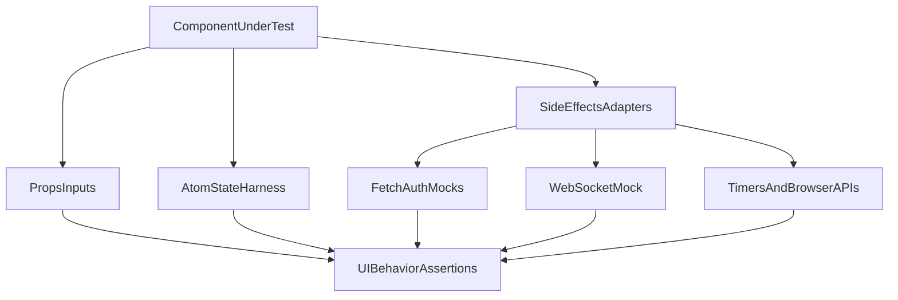

# Unit + E2E + Isolation Plan

## Goals
- Add a reliable automated testing baseline (unit + e2e).
- Cover high-risk business logic first (DAG, orchestration helpers, API contracts).
- Ensure UI components can be tested independently through explicit boundaries and test harnesses.

## Phase 1: Establish test infrastructure
- Add test tooling and scripts in [package.json](/home/ayana/Develop/web/sevima-test/package.json):
  - Unit: `vitest`, `@testing-library/react`, `@testing-library/jest-dom`, `jsdom`, `msw`, `@vitest/coverage-v8`.
  - E2E: `@playwright/test`.
  - Scripts: `test`, `test:unit`, `test:unit:watch`, `test:e2e`, `test:e2e:headed`, `test:coverage`.
- Create config files:
  - [vitest.config.ts](/home/ayana/Develop/web/sevima-test/vitest.config.ts)
  - [playwright.config.ts](/home/ayana/Develop/web/sevima-test/playwright.config.ts)
  - [test/setup/unit.setup.ts](/home/ayana/Develop/web/sevima-test/test/setup/unit.setup.ts)
  - [test/setup/msw.server.ts](/home/ayana/Develop/web/sevima-test/test/setup/msw.server.ts)
- Add test utility wrappers for isolated rendering:
  - [test/utils/renderWithProviders.tsx](/home/ayana/Develop/web/sevima-test/test/utils/renderWithProviders.tsx) (Jotai + optional ReactFlow provider helpers)

## Setup and teardown guarantees
- Unit test lifecycle (Vitest):
  - Global `beforeAll`: start MSW server and apply shared browser/polyfill shims.
  - Global `afterEach`: `cleanup()` from Testing Library, `vi.clearAllMocks()`, `vi.restoreAllMocks()`, reset fake timers, `server.resetHandlers()`, and clear local/session storage.
  - Global `afterAll`: `server.close()` and release any global listeners.
  - File-level pattern: each suite builds fresh atom/provider state in `beforeEach` and disposes custom resources in `afterEach`.
- E2E lifecycle (Playwright):
  - Per-worker setup: launch isolated browser context and authenticated storage state (or perform login fixture).
  - Per-test isolation: new page/context fixture, deterministic seed data, and strict network/console failure surfacing.
  - Per-test teardown: close page/context and rollback/cleanup test artifacts (workflow names/tenant-scoped entities).
  - Global teardown: stop web server and clear ephemeral test DB artifacts.
- CI safety:
  - Fail build on leaked handles/open sockets (`--detectOpenHandles` equivalent strategy for Vitest/Node flags and strict Playwright exit checks).
  - Run unit and e2e in separate jobs to avoid cross-suite contamination.

## Phase 2: Unit tests for pure and near-pure logic (fast wins)
- DAG utilities:
  - [lib/dag/inputInterpolation.ts](/home/ayana/Develop/web/sevima-test/lib/dag/inputInterpolation.ts)
  - [lib/dag/validator.ts](/home/ayana/Develop/web/sevima-test/lib/dag/validator.ts)
  - [lib/dag/ioResolver.ts](/home/ayana/Develop/web/sevima-test/lib/dag/ioResolver.ts)
- Canvas/data conversion:
  - [lib/canvas/dagExporter.ts](/home/ayana/Develop/web/sevima-test/lib/canvas/dagExporter.ts)
  - [lib/canvas/dagImporter.ts](/home/ayana/Develop/web/sevima-test/lib/canvas/dagImporter.ts)
  - [lib/canvas/editorState.ts](/home/ayana/Develop/web/sevima-test/lib/canvas/editorState.ts)
- Runtime helpers:
  - [lib/workflow/runHistorySort.ts](/home/ayana/Develop/web/sevima-test/lib/workflow/runHistorySort.ts)
  - [lib/socket/runWebSocketUrl.ts](/home/ayana/Develop/web/sevima-test/lib/socket/runWebSocketUrl.ts)
- Place specs under `test/unit/**` mirroring source paths for discoverability.

## Coverage matrix (required in every layer)
- Happy path:
  - Valid DAGs, successful save/run flows, expected UI interactions, successful WS lifecycle.
  - API routes return expected success payloads and metadata.
- Malformed input path:
  - Invalid UUID params, invalid query/body schema shapes, missing required fields, bad enum values.
  - DAG validation rejects structural/logical/security-invalid definitions.
  - Client helpers handle malformed/partial JSON responses safely.
- Chaotic/failure path:
  - Network failures, timeouts, WS handshake failure/close codes, out-of-order WS frames.
  - Upstream auth failures (401/403), not found (404), validation failure (422), rate limit (429).
  - Runner-level abnormal outputs (non-JSON logs, missing fields, unexpected payload types).
  - Retries/backoff branches and terminal failure outcomes.

## Phase 3: Component isolation test harnesses
- Build repeatable test harness utilities so each component can be tested separately from app runtime:
  - Jotai seed helper for atom state setup/inspection.
  - ReactFlow shim/helper for components using `Handle`/`useReactFlow`.
  - Fetch/auth mocking helpers for components using `authClient` and browser APIs.
- Apply harness-driven tests to prioritized components:
  - [components/nodes/BaseNode.tsx](/home/ayana/Develop/web/sevima-test/components/nodes/BaseNode.tsx)
  - [components/ui/NodeSettings.tsx](/home/ayana/Develop/web/sevima-test/components/ui/NodeSettings.tsx)
  - [components/nodes/HttpNodeForm.tsx](/home/ayana/Develop/web/sevima-test/components/nodes/HttpNodeForm.tsx)
  - [components/ui/ExecutionSidebar.tsx](/home/ayana/Develop/web/sevima-test/components/ui/ExecutionSidebar.tsx)
  - [components/ui/ContextMenu.tsx](/home/ayana/Develop/web/sevima-test/components/ui/ContextMenu.tsx)
- Where components are over-coupled, introduce minimal seam extraction (pure mapping/format helpers) without changing behavior.

## Phase 4: API route tests (integration-style, mocked boundaries)
- Add route-level tests for auth/RBAC/validation/rate-limit contracts:
  - [app/api/workflows/route.ts](/home/ayana/Develop/web/sevima-test/app/api/workflows/route.ts)
  - [app/api/workflows/[id]/route.ts](/home/ayana/Develop/web/sevima-test/app/api/workflows/[id]/route.ts)
  - [app/api/workflows/[id]/run/route.ts](/home/ayana/Develop/web/sevima-test/app/api/workflows/[id]/run/route.ts)
  - [app/api/workflows/[id]/runs/route.ts](/home/ayana/Develop/web/sevima-test/app/api/workflows/[id]/runs/route.ts)
- Mock at route boundaries:
  - `resolveTenantContext`, Prisma clients, rate limiter, and orchestration triggers.
- Verify status codes and payload shapes for success + critical failures (401/403/404/422/429).
- Add explicit negative-case table per route: malformed request, unauthorized role, dependency error, and rate-limit edge.

## Phase 5: E2E scenarios (Playwright)
- Create stable seeded-user flow and smoke coverage:
  - Login -> workflows list renders.
  - Create workflow from modal -> lands in canvas.
  - Add/edit node settings -> autosave triggers expected UX state.
  - Trigger run -> execution sidebar opens and shows run state updates.
- Add resilience scenarios:
  - Invalid session/token during run start.
  - WS connection drops mid-run and UI shows recoverable error state.
  - Backend returns transient failures and UI remains interactive/non-corrupt.
- Keep e2e resilient by avoiding brittle visual selectors:
  - Prefer role/label/test-id selectors.
  - Add targeted `data-testid` only where semantic selectors are not feasible.
- Wire environment bootstrap in [README.md](/home/ayana/Develop/web/sevima-test/README.md) (test DB/env guidance + CI execution command).

## Phase 6: Coverage gates and CI-ready quality checks
- Add baseline coverage threshold for unit tests (start pragmatic, then raise).
- Separate CI lanes:
  - `lint`
  - `test:unit`
  - `test:e2e` (against running app service)
- Deliver testing docs:
  - What to run locally.
  - How to seed/reset test data.
  - How to add tests for new components/routes.

## Isolation model (how components become independently testable)

## Expected outcomes
- Deterministic unit suite for core logic and component behavior.
- Reliable end-to-end regression suite for critical user paths.
- A repeatable isolation pattern that keeps future component tests fast and independent.

## Acceptance gate (strict)
- For each critical module in scope, tests must include at least:
  - 1 happy-path case
  - 1 malformed-input case
  - 1 chaotic/failure-path case
- A module is not considered complete until all three categories pass in CI.
