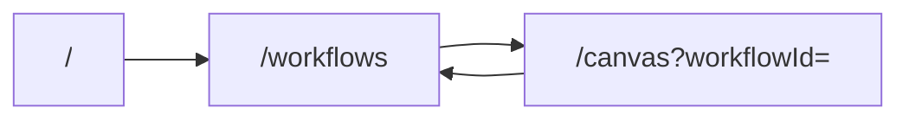

# Workflows hub and canvas routing refactor (updated)

## Goals

- **Canvas** ([`app/page.tsx`](app/page.tsx)): remove [`Sidebar`](components/layout/Sidebar.tsx); **delete** `isSidebarOpen` / menu toggle everywhere.
- **Hub** (layout inspired by [`llm-implementation-plan/image.png`](llm-implementation-plan/image.png)): **props-driven** left shell; single nav item **Workflows**; **no** Help Center, Support, Logout.
- **Branding**: **Only** existing patterns—gradient + `account_tree` (or current logo usage), [`tenantNameAtom`](store/workflowStore.ts) / **FlowForge** fallback, Manrope/stone palette from [`TopHeader`](components/layout/TopHeader.tsx). **Do not** introduce “Automation Studio” or other new product names in UI copy.
- **New workflow modal** (inspired by [`new-workflow-popup.png`](llm-implementation-plan/new-workflow-popup.png)): **1:1 with DB**—only fields that map to [`Workflow`](prisma/tenant/schema.prisma): **`name`** (required), **`description`** (optional). **No** category column, no encoding extra data in `description`. Styling matches current project (tactile/stone, gradient primary button).
- **List**: all workflows in tenant, **search** + **sort by name**; no category filter tabs.
- **Canvas** [`TopHeader`](components/layout/TopHeader.tsx): **back** replaces menu (~line 115) → **`/workflows`**.

## Database (tenant) — editor positions

- **Change**: Add nullable **`editorState Json?`** on **`WorkflowVersion`** in [`prisma/tenant/schema.prisma`](prisma/tenant/schema.prisma).
- **Purpose**: Persist **React Flow** editor state (e.g. **`nodes`** / **`edges`** including **`position`**, optional **`viewport`**), separate from **`definition`**, which remains the **engine DAG** JSON for execution.
- **New workflow from modal**: First version row uses **`definition: {}`** (empty object) as requested—**draft** until the user builds/saves a valid DAG. **Do not** run [`validateDag`](lib/dag/validator.ts) on POST when persisting this empty draft.
- **Migration**: New SQL under [`prisma/tenant/migrations/`](prisma/tenant/migrations/); run **`migrate deploy`** for tenant DBs (provisioning + [`scripts/migrate-tenants.ts`](scripts/migrate-tenants.ts)); regenerate tenant client.

## Routing

- [`app/page.tsx`](app/page.tsx): **server** `redirect('/workflows')`.
- [`app/workflows/page.tsx`](app/workflows/page.tsx): hub UI.
- [`app/canvas/page.tsx`](app/canvas/page.tsx): current canvas (moved from `app/page.tsx`).

## API ([`app/api/workflows/route.ts`](app/api/workflows/route.ts) and [`[id]/route.ts`](app/api/workflows/[id]/route.ts))

- **GET** `/api/workflows`: All workflows in tenant; **`search`** (name `contains` insensitive), **`sort`**=`name`|`updatedAt`.
- **POST** `/api/workflows`:
  - Body: **`{ name, description? }`** only (aligned with create path); **`ownerId`** = current user from JWT (unchanged).
  - Create **`WorkflowVersion`** with **`definition: {}`** (empty JSON) and **`editorState: null`** or **`{}`** per chosen shape—**no** `validateDag` for this initial create.
  - If client later sends **`definition`** + **`editorState`** on create, validate **only when `definition` is non-empty** (engine-bound DAG).
- **PATCH** `/api/workflows/:id`: When saving from canvas, persist **`definition`** (exported DAG, validated when non-empty) and **`editorState`** (full RF snapshot or agreed shape). Bump version per existing PATCH logic where applicable.

## Client: load / save

- **Load**: `GET /api/workflows/:id` returns latest version with **`definition`** + **`editorState`**. Hydrate canvas: **prefer `editorState`** for node positions when present; **fallback** DAG import from `definition` via [`dagImporter`](lib/canvas/dagImporter.ts) with layout grid when `definition` is `{}` or incomplete.
- **Save** ([`useWorkflowSave`](hooks/useWorkflowSave.ts) / PATCH): Send **`definition`** from [`exportCanvasToDag`](lib/canvas/dagExporter.ts) **and** **`editorState`** serialized from current React Flow `nodes`/`edges` (including positions).

## Layout components

- **`AppShellSidebar`**: Props **`brand`**, **`navItems`**, optional **`footer`**; brand uses **tenant name + existing visual identity** (not new marketing strings).

## TopHeader

- Remove sidebar toggle; **back** to `/workflows`; used on **canvas** only.

## Removals

- Delete [`Sidebar.tsx`](components/layout/Sidebar.tsx); remove [`isSidebarOpenAtom`](store/workflowStore.ts).

## Out of scope

- Pagination, per-row play/enable, extra nav items beyond Workflows.

## Files (summary)

| Area | Files |
|------|--------|
| Tenant schema + migration | `prisma/tenant/schema.prisma`, `prisma/tenant/migrations/*/migration.sql` |
| Routes | `app/page.tsx`, `app/workflows/page.tsx`, `app/canvas/page.tsx` |
| API | `app/api/workflows/route.ts`, `app/api/workflows/[id]/route.ts` |
| Canvas | `lib/canvas/dagImporter.ts`, merge save/load with `editorState` |
| UI | `AppShellSidebar`, workflows list, `NewWorkflowModal` |
| Header | `TopHeader.tsx` |
| Store | `workflowStore.ts` |
