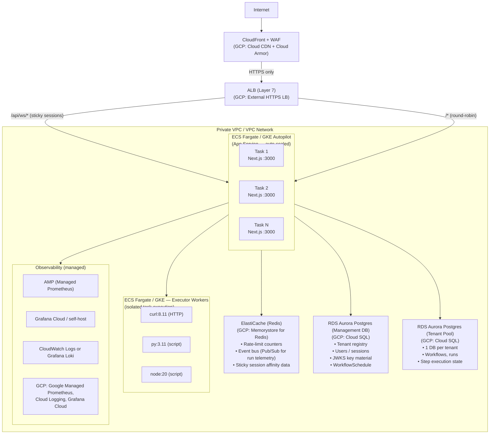

# Infrastructure Design: Production Deployment on AWS / GCP

This document describes a production-grade architecture for deploying the **Multi-Tenant DAG Workflow Engine** on a major cloud provider. The primary reference is AWS, with GCP equivalents noted inline.

---

## High-Level Architecture Diagram



---

## Component Breakdown and Design Choices

### 1. Edge Layer — CDN + WAF

| Concern | Choice | Rationale |
|---------|--------|-----------|
| **CDN** | CloudFront (AWS) / Cloud CDN (GCP) | Cache Next.js static assets (`/_next/static/*`, `/public/*`). Reduces origin load substantially since the React Flow canvas bundles are large. |
| **WAF** | AWS WAF / Cloud Armor | Block common OWASP attacks, rate-limit at the edge (defense-in-depth on top of app-level `lib/rateLimit/`). Geo-restriction if warranted. |
| **TLS** | ACM / Google-managed cert on the LB | End-to-end HTTPS. WebSocket upgrade (`wss://`) is terminated at ALB. |

### 2. Load Balancer — Application Load Balancer (Layer 7)

| Concern | Choice | Rationale |
|---------|--------|-----------|
| **Protocol** | HTTPS → HTTP to targets | TLS termination at ALB; internal traffic stays in VPC. |
| **WebSocket routing** | Path-based rule `/api/ws/*` with **sticky sessions** (cookie affinity, 1h TTL) | The current in-memory event bus (`lib/socket/eventBus.ts`) and `engineStartedRunIds` set require that a client's WebSocket lands on the same task that is executing the run. Stickiness is the simplest mitigation before a full Redis Pub/Sub migration. |
| **Health check** | `GET /api/metrics` (200 OK) | Already exposed by the app; reuse it. |
| **Auto-scaling trigger** | Target tracking: average CPU 60%, request count per target | The app is CPU-bound during DAG execution (container orchestration, JSON serialization). |

> **GCP equivalent:** External HTTPS Load Balancer with URL Map, backend service with session affinity (GENERATED_COOKIE), and managed instance group or NEG for GKE.

### 3. Compute — ECS Fargate (AWS) / GKE Autopilot (GCP)

The Next.js app runs as a stateless container — Fargate/Autopilot eliminates node management.

| Parameter | Value | Rationale |
|-----------|-------|-----------|
| **vCPU** | 1–2 per task | Next.js server + Dockerode client; DAG engine uses `p-limit(5)` parallelism per run. |
| **Memory** | 2–4 GB | Node.js heap + Prisma connection pools. |
| **Min tasks** | 2 | HA across AZs. |
| **Max tasks** | 10+ (tier-dependent) | Auto-scale on CPU / ALB request count. |
| **Deployment** | Rolling update, min healthy 50% | Zero-downtime deploy. `prisma migrate deploy` in entrypoint is idempotent. |

#### Container Runtime for Workflow Steps (critical design decision)

The current architecture mounts the Docker socket into the app container and uses Dockerode to `docker run` step containers (curl, Python, Node, Alpine). In production this is a security risk (full Docker daemon access). Options:

| Strategy | AWS | GCP | Trade-offs |
|----------|-----|-----|------------|
| **ECS RunTask (recommended)** | App calls ECS `RunTask` API for each step, specifying the image and env. Tasks run in an isolated Fargate task. | Cloud Run Jobs or GKE Jobs | Eliminates socket mount. Adds ~2-5s cold-start per step but is secure and scalable. Requires refactoring `dockerRunner.ts` to an ECS/GKE client. |
| **Sidecar DinD** | Docker-in-Docker sidecar with resource limits | Same on GKE | Retains Dockerode API, but DinD has known security and storage-driver issues. |
| **Kubernetes Jobs** | EKS + Job CRDs | GKE Jobs | Native to k8s; good if already on EKS/GKE. The `dockerRunner` becomes a k8s Job launcher. |

**Recommendation:** Refactor to **ECS RunTask** (or **GKE Jobs**) as the executor backend. The `dockerRunner.ts` abstraction already separates image selection and log capture — the interface can be swapped to call cloud APIs instead of Dockerode.

### 4. Database — RDS Aurora PostgreSQL (AWS) / Cloud SQL (GCP)

#### Management Database

| Parameter | Value | Rationale |
|-----------|-------|-----------|
| **Engine** | Aurora PostgreSQL 16 Serverless v2 | Matches current Postgres 16 + pg_cron. Serverless v2 scales ACUs on demand. |
| **Min ACU** | 0.5 | Management DB is low-traffic (auth, tenant lookup). |
| **Max ACU** | 4 | Spike during bulk tenant provisioning. |
| **Multi-AZ** | Yes | HA for the auth/session path. |
| **Backups** | Continuous (PITR 35 days) | Tenant registry is the most critical dataset. |
| **pg_cron** | Aurora supports pg_cron via `shared_preload_libraries` parameter group | Required for `WorkflowSchedule`. |

#### Tenant Databases

The system creates one Postgres database per tenant (`Tenant.connectionUrl`).

| Strategy | Description | Recommendation |
|----------|-------------|----------------|
| **Shared cluster, separate databases** | All tenants on one Aurora cluster with different `database` names. `connectionUrl` = same host, different DB. | Best for <100 tenants. Simple ops, shared backups. Noisy-neighbor risk mitigated by Aurora IO scaling. |
| **Separate clusters** | One Aurora cluster per enterprise tenant. | For large/regulated tenants needing full isolation and independent scaling. |
| **Hybrid** | Shared cluster for free/small tenants; dedicated clusters for enterprise. | Recommended long-term. Route via `connectionUrl` already supports this natively. |

Tenant provisioning (`POST /api/tenants`) should call `CREATE DATABASE` on the shared cluster (or provision a new cluster via IaC for enterprise). The `connectionUrl` stored in management DB controls routing — no code changes needed.

> **GCP:** Cloud SQL for PostgreSQL with the same shared-instance / dedicated-instance strategy. Consider AlloyDB for larger scale.

### 5. Redis — ElastiCache (AWS) / Memorystore (GCP)

The current app uses in-memory stores for:
- **Rate limiting** (`lib/rateLimit/memory.ts`)
- **Event bus** (`lib/socket/eventBus.ts`) — WebSocket telemetry fan-out
- **Run dedup** (`engineStartedRunIds`) — prevents double-starting a run

All of these break with >1 instance. Redis replaces them:

| Use Case | Redis Feature |
|----------|---------------|
| Rate limiting | `INCR` + `EXPIRE` (sliding window) |
| Event bus | Redis Pub/Sub channels per `runId` / tenant — every app instance subscribes |
| Run dedup | `SET NX` with TTL |

| Parameter | Value |
|-----------|-------|
| **Node type** | `cache.r7g.large` (AWS) / M1 standard (GCP) |
| **Cluster mode** | Disabled (single shard is sufficient for <100K events/s) |
| **Multi-AZ** | Yes, with automatic failover |

### 6. Secrets Management

| Secret | Store | Rationale |
|--------|-------|-----------|
| `BETTER_AUTH_SECRET` | AWS Secrets Manager / GCP Secret Manager | Rotatable; injected as ECS task env via `valueFrom`. |
| `MANAGEMENT_DATABASE_URL` | Secrets Manager | Contains credentials. |
| `Tenant.connectionUrl` values | Encrypted at rest in management DB (Aurora encryption) + TLS in transit | Already stored in DB; add column-level encryption if compliance requires. |
| Grafana admin password | Secrets Manager | Injected into Grafana container. |

### 7. Observability — Managed Services

| Current (Dev) | Production Replacement | Rationale |
|---------------|----------------------|-----------|
| Self-hosted Prometheus | **Amazon Managed Prometheus (AMP)** / GCP Managed Prometheus | HA, no disk management, long-term retention. App's `/api/metrics` endpoint scraped by AMP remote-write agent or Prometheus sidecar. |
| Self-hosted Loki | **Amazon CloudWatch Logs** or **Grafana Cloud Loki** / GCP Cloud Logging | `pushStepLog` in `lib/metrics/lokiPush.ts` can target a managed Loki endpoint or be replaced with a CloudWatch SDK call. |
| Self-hosted Grafana | **Grafana Cloud** or **Amazon Managed Grafana** / GCP's Grafana marketplace | SSO integration, managed upgrades, pre-built alerting. JWT auth config (`grafana.ini`) works with any Grafana deployment — update `JWKS_HTTP_URL` and `expect_claims` issuer to the production domain. |

**`/api/metrics` security:** Currently unauthenticated. In production, restrict via:
- Security group: only allow the Prometheus scraper's IP/SG.
- Or: add a shared-secret header check in the route.

### 8. Networking and Security

```
VPC (10.0.0.0/16)
├── Public subnets (2 AZs)      → ALB, NAT Gateway
├── Private subnets (2 AZs)     → ECS tasks (app + executors)
├── Database subnets (2 AZs)    → Aurora, ElastiCache
└── Security Groups
    ├── sg-alb        : 443 from 0.0.0.0/0
    ├── sg-app        : 3000 from sg-alb only
    ├── sg-executor   : no inbound (outbound-only for image pull + curl targets)
    ├── sg-aurora      : 5432 from sg-app only
    └── sg-redis      : 6379 from sg-app only
```

| Concern | Implementation |
|---------|---------------|
| **No public IPs on tasks** | Fargate tasks in private subnets; NAT Gateway for outbound (image pulls, external HTTP calls from workflow steps). |
| **ECR / Artifact Registry** | Pre-pull and cache executor images (`curl`, `python`, `node`, `alpine`) in a private registry to avoid Docker Hub rate limits and improve cold-start times. |
| **VPC endpoints** | S3 (for Aurora backups), ECR, Secrets Manager, CloudWatch — reduce NAT costs and improve latency. |
| **IAM / Workload Identity** | ECS task role with least-privilege: `ecr:GetAuthorizationToken`, `ecs:RunTask` (for executor tasks), `secretsmanager:GetSecretValue`, `aps:RemoteWrite`. |

### 9. Auto-Scaling Strategy

| Layer | Metric | Target | Min | Max |
|-------|--------|--------|-----|-----|
| **App tasks** | CPU utilization | 60% | 2 | 10 |
| **App tasks** | ALB request count per target | 1000 req/min | 2 | 10 |
| **Executor tasks** | Queue depth (custom metric: pending step runs) | — | 0 | 50 |
| **Aurora** | Serverless v2 auto-scales ACUs | — | 0.5 | 16 |
| **Redis** | Managed auto-scaling (read replicas if needed) | — | — | — |

### 10. CI/CD Pipeline

```
GitHub Push → GitHub Actions
  ├── Lint + Type Check (npm run lint && tsc --noEmit)
  ├── Unit Tests (npm run test:unit)
  ├── Build Docker Image → Push to ECR / Artifact Registry
  ├── E2E Tests against staging (Playwright)
  ├── Prisma migrate deploy (management + tenant schemas) against staging DB
  └── Deploy
       ├── Staging: auto-deploy on main
       └── Production: manual approval gate → ECS rolling update
```

### 11. Disaster Recovery and Backup

| Component | RPO | RTO | Strategy |
|-----------|-----|-----|----------|
| Management DB | ~0 (continuous) | <5 min | Aurora PITR + cross-region replica |
| Tenant DBs | ~0 (continuous) | <5 min | Same Aurora cluster PITR |
| App containers | N/A (stateless) | <2 min | ECS re-deploys from ECR image |
| Redis | Best-effort (cache) | <1 min | Multi-AZ auto-failover; data is reconstructable |

### 12. Cost Estimate (AWS, rough monthly for a small-to-medium workload)

| Component | Estimated Cost |
|-----------|---------------|
| ALB | $25 + LCU charges |
| ECS Fargate (2× 1vCPU/2GB 24/7) | ~$70 |
| Aurora Serverless v2 (0.5–4 ACU) | ~$50–150 |
| ElastiCache (r7g.large) | ~$120 |
| NAT Gateway | ~$35 + data |
| CloudFront | ~$10–50 (depending on traffic) |
| Secrets Manager | <$5 |
| AMP + Managed Grafana | ~$30–80 |
| **Total** | **~$350–550/mo** |

Costs scale linearly with tenant count and workflow execution frequency. The executor tasks (Fargate RunTask) are billed per-second and only run during active workflow steps.

---

## Summary of Key Architectural Decisions

1. **Fargate over EC2/VMs** — eliminates server management; the app is already containerized and stateless.
2. **Redis for shared state** — the single most important change from dev to production; replaces three in-memory stores that prevent horizontal scaling.
3. **ECS RunTask for workflow step execution** — replaces the Docker socket mount with a secure, scalable, cloud-native executor. Each workflow step becomes an isolated Fargate task.
4. **Aurora Serverless v2** — matches the per-tenant-database model with on-demand scaling. No need to pre-provision for peak.
5. **Managed observability** — eliminates operational burden of self-hosted Prometheus/Loki/Grafana while preserving existing metrics and dashboard definitions.
6. **Sticky sessions for WebSockets** — pragmatic short-term; Redis Pub/Sub for the event bus is the path to fully stateless instances.
